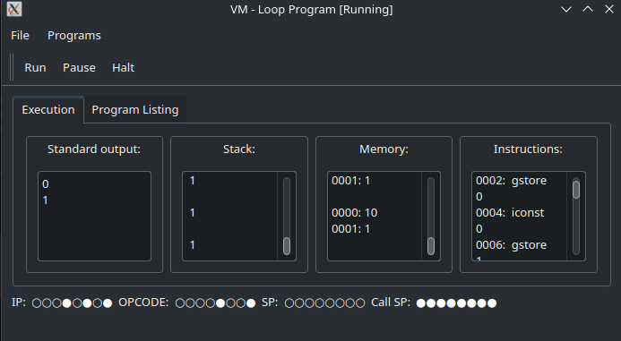

# VM - Qt Virtual Machine Visualizer



A Qt-based GUI application that visualizes the execution of a simple stack-based virtual machine. This project extends the original C-based VM implementation with a graphical interface for real-time debugging and visualization.

## Features

- **Real-time VM Execution**: Step-by-step visualization of VM instruction execution
- **Interactive GUI**: Displays registers, stack, memory, and instructions in real-time
- **Multiple Test Programs**: Includes hello world, loop, and factorial examples
- **Visual Register Display**: Binary representation of IP, SP, Call SP, and OPCODE registers
- **Thread-based Execution**: VM runs in a separate thread for responsive UI

## Architecture

The application consists of:

- **VM Core** (`vm.cpp`, `vm.h`): Stack-based virtual machine with CALL/RET support
- **GUI Interface** (`mainwindow.cpp`, `mainwindow.h`, `mainwindow.ui`): Qt-based visualization
- **Test Programs**: Pre-compiled bytecode examples for demonstration

## VM Instruction Set

The VM supports the following instructions:

| Opcode | Name | Description | Args |
|--------|------|-------------|------|
| 0 | NOOP | No operation | 0 |
| 1 | IADD | Integer addition | 0 |
| 2 | ISUB | Integer subtraction | 0 |
| 3 | IMUL | Integer multiplication | 0 |
| 4 | ILT | Integer less than comparison | 0 |
| 5 | IEQ | Integer equality comparison | 0 |
| 6 | BR | Unconditional branch | 1 |
| 7 | BRT | Branch if true | 1 |
| 8 | BRF | Branch if false | 1 |
| 9 | ICONST | Push constant integer | 1 |
| 10 | LOAD | Load from local context | 1 |
| 11 | GLOAD | Load from global memory | 1 |
| 12 | STORE | Store in local context | 1 |
| 13 | GSTORE | Store in global memory | 1 |
| 14 | PRINT | Print stack top | 0 |
| 15 | POP | Pop stack top | 0 |
| 16 | CALL | Call function | 3 |
| 17 | RET | Return from function | 0 |
| 18 | HALT | Halt execution | 0 |

## Build Requirements

- Qt 5.x or Qt 6.x
- C++17 compatible compiler (GCC 7+, Clang 5+, MSVC 2017+)
- CMake 3.16.0 or later

## Build and Run

### Using CMake

#### Linux (Ubuntu/Debian)

1. Install dependencies:
```bash
# Ubuntu/Debian
sudo apt update
sudo apt install qt5-default qtbase5-dev cmake build-essential

# For Qt 6 (if preferred)
sudo apt install qt6-base-dev qt6-tools-dev cmake build-essential
```

2. Build the project:
```bash
mkdir build
cd build
cmake ..
make
./vm
```

#### Linux (Fedora/RHEL/CentOS)

```bash
# Install dependencies
sudo dnf install qt5-qtbase-devel qt5-qttools-devel cmake gcc-c++ make

# For Qt 6 (if preferred)
sudo dnf install qt6-qtbase-devel qt6-qttools-devel cmake gcc-c++ make

# Build
mkdir build
cd build
cmake ..
make
./vm
```

#### Linux (Arch)

```bash
# Install dependencies
sudo pacman -S qt5-base qt5-tools cmake base-devel

# For Qt 6 (if preferred)
sudo pacman -S qt6-base qt6-tools cmake base-devel

# Build
mkdir build
cd build
cmake ..
make
./vm
```

#### macOS

1. Install dependencies using Homebrew:
```bash
# Install Homebrew if not already installed
/bin/bash -c "$(curl -fsSL https://raw.githubusercontent.com/Homebrew/install/HEAD/install.sh)"

# Install Qt and CMake
brew install qt@5 cmake

# For Qt 6 (if preferred)
brew install qt@6
```

2. Build the project:
```bash
mkdir build
cd build
cmake ..
make
open vm  # or ./vm
```

3. If Qt is not in the default path, set Qt_DIR:
```bash
cmake -DQt5_DIR=$(brew --prefix qt@5)/lib/cmake/Qt5 ..
```

#### Windows

**Option 1: Using vcpkg**

1. Install vcpkg:
```cmd
git clone https://github.com/Microsoft/vcpkg.git
cd vcpkg
.\bootstrap-vcpkg.bat
```

2. Install Qt5:
```cmd
.\vcpkg install qt5:x64-windows
.\vcpkg integrate install
```

3. Build with Visual Studio:
```cmd
mkdir build
cd build
cmake .. -DCMAKE_TOOLCHAIN_FILE=C:\path\to\vcpkg\scripts\buildsystems\vcpkg.cmake
cmake --build . --config Release
```

4. Run the executable:
```cmd
.\Release\vm.exe
```

**Option 2: Using Qt Installer**

1. Download and install Qt from [qt.io/download](https://www.qt.io/download)
2. Install CMake from [cmake.org](https://cmake.org/)
3. Build using Visual Studio Developer Command Prompt:
```cmd
mkdir build
cd build
cmake .. -G "Visual Studio 16 2019" -A x64
cmake --build . --config Release
```

4. Run the executable:
```cmd
.\Release\vm.exe
```

**Option 3: Using MinGW**

1. Install Qt with MinGW from [qt.io/download](https://www.qt.io/download)
2. Install MSYS2 and MinGW-w64
3. Build:
```cmd
mkdir build
cd build
cmake .. -G "MinGW Makefiles"
mingw32-make
```

### Using qmake (Alternative)

```bash
# Linux/macOS
qmake vm.pro
make
./vm

# Windows (Visual Studio)
qmake vm.pro -tp vc
# Open generated .vcxproj in Visual Studio

# Windows (MinGW)
qmake vm.pro
mingw32-make
vm.exe
```

### Troubleshooting

**Qt not found:**
- Make sure Qt development packages are installed
- Set `Qt5_DIR` or `Qt6_DIR` environment variable to Qt's CMake directory
- On Windows with vcpkg: Use the toolchain file as shown above

**Compiler errors:**
- Ensure C++17 support is enabled
- On GCC/Clang: `--std=c++17` or newer
- On MSVC: `/std:c++17` or newer

**Linking errors:**
- Verify Qt libraries match the architecture (32/64-bit)
- Check that you have the development headers, not just runtime libraries

**CMake configuration issues:**
- Use `cmake --version` to verify minimum version (3.16.0+)
- Use `cmake --help` to see available generators for your platform

## GUI Components

The main window displays:

- **Standard Output**: Shows program output from PRINT instructions
- **Stack**: Visualizes the operand stack in real-time
- **Memory**: Displays global variable contents
- **Instructions**: Shows current and executed instructions
- **Register Display**: Binary visualization of:
  - IP (Instruction Pointer)
  - SP (Stack Pointer) 
  - Call SP (Call Stack Pointer)
  - OPCODE (Current instruction)

## Test Programs

The application includes three test programs:

1. **Hello World**: Simple constant printing
2. **Loop**: Demonstrates branching and global variables
3. **Factorial**: Recursive function with CALL/RET instructions

## VM Implementation Details

- **Stack Size**: 1000 integers
- **Call Stack Size**: 100 contexts
- **Local Variables**: Up to 10 per function context
- **Execution Speed**: 1000ms delay per instruction for visualization
- **Thread-based**: VM runs in QThread for non-blocking UI

## Origins

This project is based on the simple VM implementation by [Terence Parr](https://github.com/parrt/simple-virtual-machine) and extends the C port by [Cody Ebberson](https://github.com/codyebberson/vm) with Qt GUI visualization and enhanced debugging capabilities.

## License

This project is licensed under the MIT License. See the [LICENSE](LICENSE) file for details.